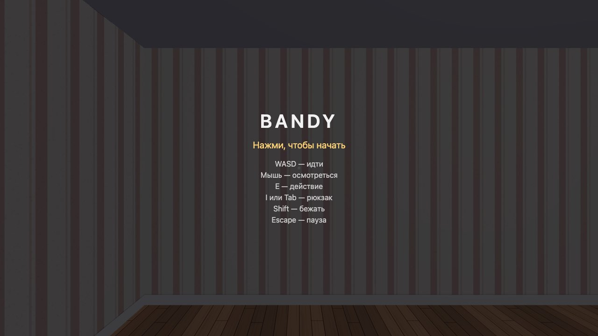
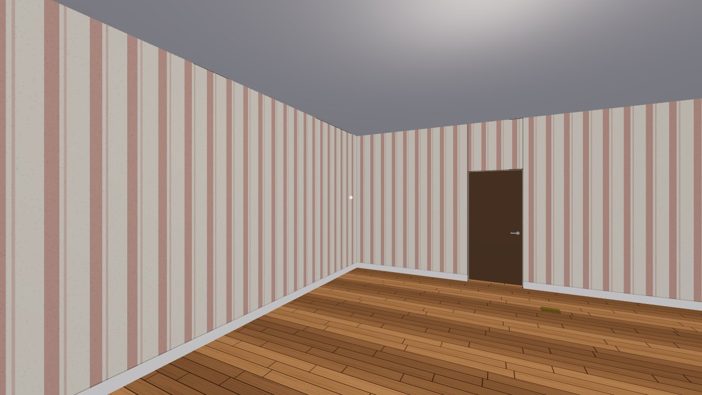
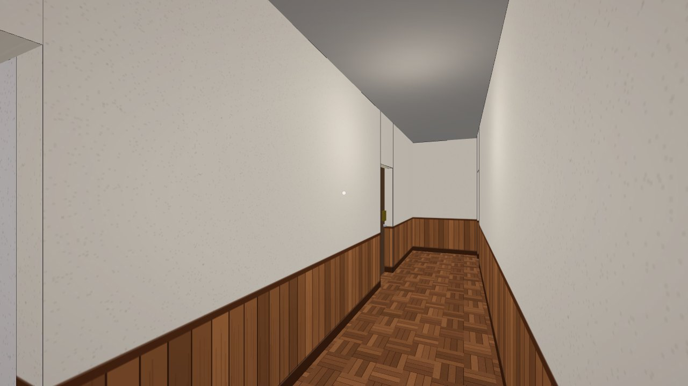

# Bandy

Браузерная 3D-игра от первого лица. Ходишь по дому из комнат, подбираешь
предметы, открываешь ключами замки и ищешь дверь с табличкой EXIT: за ней
длинный коридор с белым светом в конце. На третьем уровне по дому ходит
антагонист. Он патрулирует, замечает игрока и гонится за ним, так что
приходится убегать.

По духу игра похожа на Hello Neighbor. Играть можно и с компьютера (мышь и
клавиатура), и с телефона (сенсорное управление).

**Играть онлайн: https://navoznov.github.io/bandy/**

| | |
|---|---|
|  |  |
| Стартовый экран с управлением | Первый уровень: дверь дальше и ключ на полу |
|  | |
| Третий уровень: коридор вокруг шахты, по которому ходит антагонист | |

## Содержание

- [Возможности](#возможности)
- [Быстрый старт](#быстрый-старт)
- [Установка](#установка)
- [Как играть](#как-играть)
- [Команды](#команды)
- [Структура проекта](#структура-проекта)
- [Как добавить уровень или предмет](#как-добавить-уровень-или-предмет)
- [Деплой на GitHub Pages](#деплой-на-github-pages)
- [Параметры запуска](#параметры-запуска)
- [Документы](#документы)
- [Лицензия](#лицензия)

## Возможности

- Четыре уровня: здание, подвал, этаж дома и ночь в пиццерии. Переход дальше —
  кнопкой на экране победы. На четвёртом нет ходьбы: сидишь в офисе, закрываешь
  двери, включаешь свет и следишь за камерами до 6 AM.
- Инвентарь с предметом в руке: подобранный ключ сначала лежит в рюкзаке, а
  чтобы открыть им замок, его надо взять в руку.
- Взаимодействия задаются данными. «Ключ на замок» — это строка в реестре, а не
  `if` в коде, поэтому новый предмет добавляется правкой JSON.
- Антагонист на третьем уровне. У него три состояния (патруль, погоня, поиск),
  конус зрения и поиск пути по графу комнат. Когда он рядом, по краям экрана
  темнеет и слышны шаги.
- Спринт с ограниченной выносливостью.
- Сенсорное управление: виртуальный стик, обзор свайпом, экранные кнопки. Игру
  можно установить на телефон как PWA.
- Уровни проверяются при загрузке. Если в карте опечатка или до выхода нельзя
  дойти, вместо игры появляется понятное сообщение об ошибке.

## Быстрый старт

Чтобы поиграть, ничего устанавливать не нужно: откройте
https://navoznov.github.io/bandy/ и кликните по экрану.

Запуск локально:

```sh
git clone https://github.com/navoznov/bandy.git
cd bandy
npm install
npm run dev
```

Vite напечатает адрес, обычно это http://localhost:5173/bandy/.

## Установка

### Требования

- **Node.js 22** (на этой версии собирает CI) и npm.
- Современный браузер с WebGL, на компьютере или на телефоне.

Больше ничего не нужно: физического движка, бэкенда и текстурных файлов нет.
Единственная зависимость рантайма — [three.js](https://threejs.org/).

### Запуск для разработки

```sh
npm install
npm run dev
```

Открывать игру надо только через dev-сервер. Из `index.html`, открытого по
`file://`, она не запустится: ES-модули так не работают.

### Запуск с телефона

```sh
npm run dev -- --host
```

Vite покажет адрес в локальной сети, например `http://192.168.1.10:5173/bandy/`.
Откройте его на телефоне в той же сети Wi-Fi. Тач-управление имеет смысл
отлаживать только на настоящем телефоне: эмуляция в DevTools неверно передаёт
инерцию, мультитач и размер пальца.

На iPhone нет Fullscreen API, поэтому удобнее всего добавить игру на домашний
экран («Поделиться» → «На экран Домой»). Тогда она откроется без адресной
строки.

### Продакшен-сборка

```sh
npm run build     # сборка в dist/
npm run preview   # отдать dist/ локально и проверить
```

## Как играть

Задача — найти дверь с табличкой EXIT и дойти до белого света в конце коридора
за ней. Двери по пути бывают заперты: ключ к замку нужно найти, подобрать, взять
в руку и навести прицел на замок.

Управление перечислено на стартовом экране.

**Компьютер.** Клик по экрану захватывает курсор и запускает игру.

| Клавиша | Действие |
|---|---|
| `W` `A` `S` `D` | Идти |
| Мышь | Осмотреться |
| `E` | Действие: открыть дверь, подобрать предмет, применить предмет в руке |
| `I` или `Tab` | Рюкзак. Клик по строке берёт предмет в руку |
| `Shift` | Бежать (пока хватает выносливости) |
| `Escape` | Пауза |

Клавиши работают при любой раскладке: игра смотрит на физическую клавишу.

**Телефон.** Держите телефон горизонтально. Стик слева — движение, свайп в
правой половине — обзор, кнопки «Действие», «Рюкзак» и «Бег» — на экране.
Захвата курсора и паузы на телефоне нет.

**Ночь (уровень 4).** Курсор не захватывается: голову поворачивает курсор у края
экрана, на телефоне — горизонтальный свайп. Двери и свет жмутся кнопками на
экране или клавишами:

| Клавиша | Действие |
|---|---|
| `Q` / `E` | Левая / правая дверь |
| `W` | Вентиляция |
| `A` / `D` | Свет слева / справа |
| `Пробел` | Поднять или опустить монитор камер |

## Команды

| Команда | Что делает |
|---|---|
| `npm run dev` | Dev-сервер Vite |
| `npm run dev -- --host` | То же, но доступно с телефона в локальной сети |
| `npm run build` | Продакшен-сборка в `dist/` |
| `npm run preview` | Отдать собранный `dist/` |
| `npm test` | Проверка типов (`tsc --noEmit`), затем все тесты Vitest |
| `npm test src/core/collision.test.ts` | Один файл тестов |
| `npm run test:watch` | Vitest в режиме наблюдения |
| `npm run typecheck` | Только проверка типов |

`npm test` начинается с `tsc` намеренно: `vite build` типы не проверяет, и без
этого шага ошибки типов не ловились бы нигде, кроме редактора.

## Структура проекта

```
src/
  core/     чистая логика без three.js: уровень и его валидация, коллизии,
            мир, инвентарь, взаимодействия, антагонист, поиск пути, зрение,
            выносливость; здесь же почти все тесты
  render/   three.js: сцена, стены, двери, предметы, предмет в руке,
            табличка EXIT, меш антагониста
  input/    одна схема ввода для двух устройств: pointer lock + WASD
            и виртуальный стик + свайп
  ui/       DOM-оверлеи: стартовый экран, HUD, рюкзак, экраны ошибок,
            виньетка тревоги
  night/    четвёртый уровень, ночной режим: ввод офиса, HUD, монитор камер,
            скример, сцена (логика ночи — в `core/night.ts`)
  audio/    процедурные шаги антагониста и звуки ночи
  levels/   уровни в JSON, описания предметов, порядок уровней
  context.ts общий контекст запуска (канвас, рендерер, остановка цикла)
  explore.ts режим ходьбы: уровни 1–3
  config.ts все константы: размеры, скорости, настройки антагониста
  main.ts   точка входа и игровой цикл
```

Главное архитектурное правило: **`src/core/` не импортирует three.js.** Вся
игровая логика запускается и тестируется без браузера и WebGL, а рендер только
читает её состояние. Это правило и остальные соглашения описаны в
[`CLAUDE.md`](CLAUDE.md).

## Как добавить уровень или предмет

Уровни пишутся руками в JSON (`src/levels/level_*.json`). Комната задаётся
прямоугольником `[x, z, ширина, глубина]` в метрах. Дверь — парой комнат и
точкой на их общей стене, ориентацию игра выводит сама. Коридор — просто узкая
комната.

1. Создайте `src/levels/level_05.json`, взяв за образец существующий уровень.
2. Добавьте его в реестр `LEVELS` в `src/levels/index.ts`. Порядок уровней
   задаётся там, а не в JSON.
3. Откройте `http://localhost:5173/bandy/#level_05`. Если в уровне ошибка,
   валидатор покажет её на экране.

Новый предмет добавляется записью в `src/levels/items.json`, а его действие —
правилом в блоке взаимодействий уровня:

```json
{ "use": "key_brass", "on": "lock_front",
  "effects": [{"destroy": "lock_front"}, {"consume": "key_brass"}, {"sound": "unlock"}] }
```

## Деплой на GitHub Pages

Каждый пуш в `main` собирается и выкладывается workflow
[`.github/workflows/deploy.yml`](.github/workflows/deploy.yml). Для pull
request'ов он только прогоняет тесты и сборку.

Чтобы выложить свою копию:

1. Сделайте форк репозитория.
2. В **Settings → Pages → Source** выберите **GitHub Actions**. Если оставить
   публикацию из ветки, прогон упадёт на шаге `configure-pages`.
3. Если форк называется не `bandy`, поменяйте `base` в
   [`vite.config.ts`](vite.config.ts) на `'/<имя-репозитория>/'`. Иначе
   откроется белый экран, а все ресурсы будут отдавать 404.
4. Запушьте в `main` или запустите workflow вручную:
   `gh workflow run deploy.yml --ref main`.

GitHub Pages не отдаёт свои HTTP-заголовки, поэтому `SharedArrayBuffer` и
потоки в игре не используются.

## Параметры запуска

Для отладки игру можно запустить в урезанном режиме. Параметры пишутся в адресе
**до** `#уровня` и работают в dev-сервере, на проде и на телефоне:

```
https://navoznov.github.io/bandy/?antagonist=off&fps#level_03
```

| Параметр | Что делает |
|---|---|
| `antagonist=off` | Уровень без антагониста: нет погони, виньетки, шагов и поимки |
| `walls=plain` | Все комнаты с серыми стенами, без тематических узоров |
| `dpr=1` | Плотность пикселей рендера (любое положительное число). По умолчанию `min(dpr устройства, 2)` |
| `aa=off` | Без сглаживания |
| `fps` | Счётчик кадров в секунду и draw call'ов в левом верхнем углу |

Параметры сохраняются при переходе на следующий уровень кнопкой «Дальше».
Параметр, дописанный после `#` (`#level_03?fps`), не сработает, уровень тоже не
распознается, и загрузится первый.

## Документы

- Правила архитектуры и соглашения: [`CLAUDE.md`](CLAUDE.md)
- Известные и отложенные проблемы: [`known-issues.md`](known-issues.md)
- Дизайн игры: [`docs/superpowers/specs/2026-08-24-bandy-design.md`](docs/superpowers/specs/2026-08-24-bandy-design.md)
- План реализации: [`docs/superpowers/plans/2026-08-24-bandy-vertical-slice.md`](docs/superpowers/plans/2026-08-24-bandy-vertical-slice.md)
- Дизайн антагониста: [`docs/superpowers/specs/2026-08-27-bandy-antagonist-design.md`](docs/superpowers/specs/2026-08-27-bandy-antagonist-design.md)

## Лицензия

[MIT](LICENSE).
